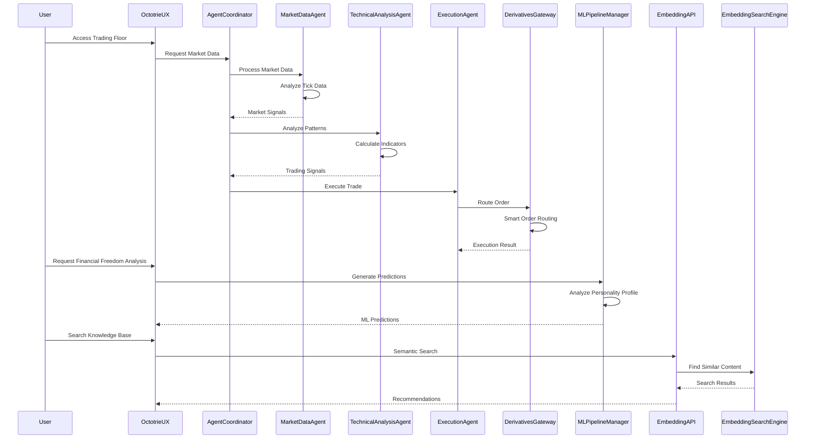
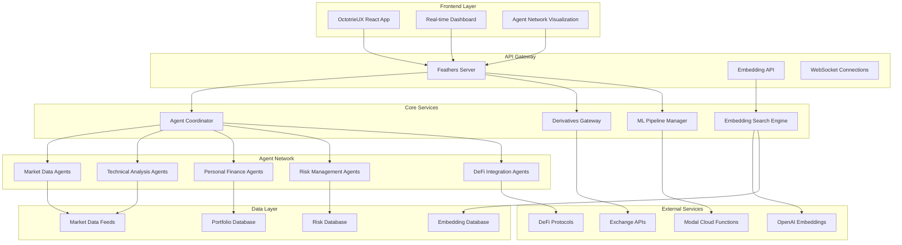
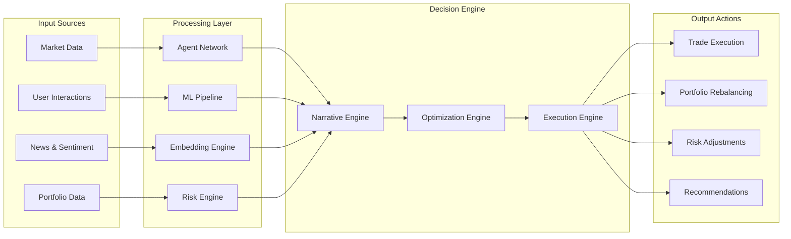

# 🦞 ACTORS System UML Architecture

## System Overview UML

```mermaid
classDiagram
    %% Core System Components
    class ACTORSSystem {
        +String version
        +String status
        +initialize()
        +start()
        +shutdown()
        +getSystemHealth()
    }

    class AgentCoordinator {
        +String id
        +List~Agent~ agents
        +Map~String, Agent~ agentRegistry
        +registerAgent(agent: Agent)
        +coordinateAgents()
        +distributeTasks()
        +monitorPerformance()
    }

    class NarrativeEngine {
        +String narrativeSpace
        +Map~String, Dimension~ dimensions
        +Float narrativeEnergy
        +Float jackieResonance
        +calculateResonance()
        +updateNarrativeEnergy()
        +optimizeHarmony()
    }

    %% 8D Narrative Dimensions
    class Dimension {
        <<enumeration>>
        SPEED
        LOYALTY
        PASSION
        SACRED
        COURAGE
        WISDOM
        LOVE
        TRUTH
    }

    class OctotrieDimension {
        +Int dimensionNumber
        +String name
        +String role
        +Float resonance
        +String icon
        +String color
        +Float energyLevel
    }

    %% Financial Agents
    class FinancialAgent {
        <<abstract>>
        +String id
        +String name
        +Dimension dimension
        +Float resonance
        +AgentStatus status
        +Float energy
        +initialize()
        +process()
        +getStatus()
        +updateEnergy()
    }

    class MarketDataAgent {
        +List~String~ instruments
        +Map~String, Float~ thresholds
        +processTickData(data: TickData)
        +addInstrument(instrument: Instrument)
        +setMovementThreshold(symbol: String, threshold: Float)
    }

    class TechnicalAnalysisAgent {
        +List~String~ symbols
        +List~TimeFrame~ timeframes
        +Map~String, Float~ signalThresholds
        +analyzePatterns()
        +generateSignals()
        +calculateIndicators()
    }

    class PersonalFinanceAgent {
        +String userId
        +RiskProfile riskProfile
        +CashFlowModel cashFlow
        +List~FinancialGoal~ goals
        +List~Portfolio~ portfolios
        +optimizeForFinancialFreedom()
        +addGoal(goal: FinancialGoal)
        +addPortfolio(portfolio: Portfolio)
    }

    class SentimentAnalysisAgent {
        +NLPProcessor nlpProcessor
        +EntityRecognizer entityRecognizer
        +processNews(news: NewsData)
        +analyzeSocialMedia(socialData: SocialData)
        +calculateSentimentScore()
    }

    class ExecutionAgent {
        +List~TradingVenue~ venues
        +executeOrder(order: Order)
        +routeOrder(order: Order)
        +monitorExecution()
        +calculateFees()
    }

    class RiskAgent {
        +RiskLimits riskLimits
        +performRiskAssessment()
        +calculateVaR()
        +stressTest()
        +monitorLimits()
    }

    class DeFiAgent {
        +Map~String, ProtocolConnector~ protocols
        +optimizeYield(amount: Float, asset: String, params: YieldParameters)
        +addProtocolConnector(name: String, connector: ProtocolConnector)
        +analyzeProtocolRisk()
    }

    %% Derivatives Gateway
    class DerivativesGateway {
        +SmartOrderRouter orderRouter
        +PortfolioOptimizer portfolioOptimizer
        +CalendarSpreadAnalyzer spreadAnalyzer
        +ExpirationManager expirationManager
        +RiskManager riskManager
        +executeOrder(order: Order)
        +optimizePortfolio(params: OptimizationParams)
        +analyzeSpreads(params: SpreadAnalysisParams)
        +manageExpirations(accountId: String, daysThreshold: Int)
    }

    class SmartOrderRouter {
        +ExecutionRepository executionRepo
        +Map~String, ExchangeConnector~ exchangeConnectors
        +RoutingEngine routingEngine
        +RiskManager riskManager
        +createExecutionPlan(order: Order)
        +routeOrder(order: Order)
        +monitorExecution()
    }

    class PortfolioOptimizer {
        +PositionRepository positionRepo
        +OptionRepository optionRepo
        +MarketDataRepository marketDataRepo
        +RiskCalculator riskCalculator
        +OptimizationEngine optimizationEngine
        +optimizePortfolio(params: OptimizationParams)
        +calculateRiskMetrics()
        +generateOptimizationReport()
    }

    class CalendarSpreadAnalyzer {
        +OptionRepository optionRepo
        +MarketDataRepository marketDataRepo
        +VolatilitySurfaceRepository volSurfaceRepo
        +TermStructureRepository termStructureRepo
        +analyzeCalendarSpreads(params: SpreadAnalysisParams)
        +detectOpportunities()
        +calculateSpreadMetrics()
    }

    class ExpirationManager {
        +OptionRepository optionRepo
        +PositionRepository positionRepo
        +StrategyRepository strategyRepo
        +MarketDataRepository marketDataRepo
        +identifyExpiringPositions(accountId: String, daysThreshold: Int)
        +findRollCandidates(option: OptionContract, position: Position)
        +analyzeAssignmentRisk()
    }

    %% Machine Learning Pipeline
    class MLPipelineManager {
        +Map~String, MLModel~ models
        +Boolean isActive
        +Map~String, MLPredictions~ predictorCache
        +initialize()
        +activate()
        +generatePredictions(responses: List~String~, profile: PersonalityProfile)
        +getHealthScore()
    }

    class MLModel {
        <<interface>>
        +modelType() String
        +predict(input: List~Float~) List~Float~
    }

    class BehaviorPredictionModel {
        +modelType() String
        +predict(input: List~Float~) List~Float~
    }

    class CareerPredictionModel {
        +modelType() String
        +predict(input: List~Float~) List~Float~
    }

    class RelationshipPredictionModel {
        +modelType() String
        +predict(input: List~Float~) List~Float~
    }

    class LearningStylePredictionModel {
        +modelType() String
        +predict(input: List~Float~) List~Float~
    }

    %% Embedding & Search System
    class EmbeddingSearchEngine {
        +String embeddingsFile
        +List~EmbeddingData~ embeddingsData
        +Matrix embeddingsMatrix
        +List~Metadata~ metadata
        +loadEmbeddings()
        +search(queryEmbedding: List~Float~, topK: Int)
        +searchByText(queryText: String, topK: Int)
        +findSimilarToId(embeddingId: String, topK: Int)
        +clusterEmbeddings(nClusters: Int)
        +getStatistics()
    }

    class EmbeddingAPI {
        +EmbeddingSearchEngine searchEngine
        +initializeSearchEngine()
        +healthCheck()
        +getStats()
        +searchEmbeddings(query: String, topK: Int)
        +findSimilar(embeddingId: String, topK: Int)
        +getEmbedding(embeddingId: String)
        +clusterEmbeddings(nClusters: Int)
        +getRecommendations(query: String, topK: Int)
        +exploreEmbeddings(limit: Int)
    }

    %% Data Models
    class Instrument {
        +String id
        +String symbol
        +String assetClass
        +String exchange
        +String currency
    }

    class TickData {
        +String instrumentId
        +Float price
        +Float volume
        +Timestamp timestamp
        +OrderBook orderBook
    }

    class Order {
        +String id
        +String instrumentId
        +OrderSide side
        +OrderType orderType
        +Float quantity
        +Float price
        +TimeInForce timeInForce
        +Timestamp createdAt
        +OrderStatus status
    }

    class Portfolio {
        +String id
        +String ownerId
        +Map~String, Position~ positions
        +Float cashBalance
        +Float totalValue
        +Timestamp createdAt
        +Timestamp lastUpdated
    }

    class Position {
        +String instrumentId
        +Float quantity
        +Float averagePrice
        +Float currentPrice
        +Float marketValue
        +Float unrealizedPnl
        +Float realizedPnl
        +Timestamp lastUpdated
    }

    class FinancialGoal {
        +String id
        +GoalType goalType
        +Float targetAmount
        +Timestamp targetDate
        +Float currentProgress
        +GoalPriority priority
    }

    class RiskProfile {
        +Float riskTolerance
        +Int timeHorizon
        +Float liquidityNeeds
        +Float incomeStability
    }

    class CashFlowModel {
        +Float monthlyIncome
        +Float monthlyExpenses
        +Float projectedIncomeGrowth
        +Float projectedExpenseGrowth
        +Float discretionaryIncome
    }

    class PersonalityProfile {
        +Map~PersonalityTrait, Float~ bigFiveTraits
        +Map~JungianType, Float~ jungianTypes
        +Float emotionalIntelligence
        +Map~String, Float~ neuralInsights
    }

    class MLPredictions {
        +List~String~ predictedBehaviors
        +List~String~ careerPaths
        +List~String~ relationshipDynamics
        +List~String~ learningStyles
        +Map~String, Float~ confidenceScores
    }

    %% User Interface
    class OctotrieUX {
        +String activeSection
        +Map~String, Object~ agentData
        +List~MarketData~ marketData
        +List~Agent~ agents
        +List~NavigationItem~ navigationItems
        +renderDashboard()
        +renderAgentNetwork()
        +renderTradingFloor()
        +renderDragonPatterns()
        +renderONNXModels()
        +renderNarrativeSpace()
        +renderFinancialFreedom()
        +renderAnalytics()
    }

    %% Server Infrastructure
    class FeathersServer {
        +Map~String, Float~ metrics
        +getMetrics()
        +getHealth()
        +getRoutes()
        +broadcastMetrics()
    }

    class ModalIntegration {
        +Image containerImage
        +generateOctotrieStory(template: String, inputText: String, useOpus: Boolean)
        +calculateDimensionResonance(dimensionData: Map)
        +captureOctotrieVisualization(story: OctotrieStory)
        +analyzeTradingAgents(agentsData: List~Map~)
    }

    %% Relationships
    ACTORSSystem --> AgentCoordinator : manages
    ACTORSSystem --> NarrativeEngine : contains
    ACTORSSystem --> DerivativesGateway : integrates
    ACTORSSystem --> MLPipelineManager : uses
    ACTORSSystem --> EmbeddingSearchEngine : includes

    AgentCoordinator --> FinancialAgent : coordinates
    NarrativeEngine --> OctotrieDimension : contains
    OctotrieDimension --> Dimension : implements

    FinancialAgent <|-- MarketDataAgent : extends
    FinancialAgent <|-- TechnicalAnalysisAgent : extends
    FinancialAgent <|-- PersonalFinanceAgent : extends
    FinancialAgent <|-- SentimentAnalysisAgent : extends
    FinancialAgent <|-- ExecutionAgent : extends
    FinancialAgent <|-- RiskAgent : extends
    FinancialAgent <|-- DeFiAgent : extends

    DerivativesGateway --> SmartOrderRouter : contains
    DerivativesGateway --> PortfolioOptimizer : contains
    DerivativesGateway --> CalendarSpreadAnalyzer : contains
    DerivativesGateway --> ExpirationManager : contains

    MLPipelineManager --> MLModel : uses
    MLModel <|-- BehaviorPredictionModel : implements
    MLModel <|-- CareerPredictionModel : implements
    MLModel <|-- RelationshipPredictionModel : implements
    MLModel <|-- LearningStylePredictionModel : implements

    EmbeddingAPI --> EmbeddingSearchEngine : uses

    MarketDataAgent --> Instrument : processes
    MarketDataAgent --> TickData : handles
    ExecutionAgent --> Order : executes
    PersonalFinanceAgent --> Portfolio : manages
    PersonalFinanceAgent --> FinancialGoal : tracks
    PersonalFinanceAgent --> RiskProfile : uses
    PersonalFinanceAgent --> CashFlowModel : analyzes

    MLPipelineManager --> PersonalityProfile : analyzes
    MLPipelineManager --> MLPredictions : generates

    OctotrieUX --> FeathersServer : connects
    ModalIntegration --> OctotrieUX : enhances
```

## Component Interaction Sequence

## System Deployment Architecture

## Data Flow Architecture

This comprehensive UML representation captures the full architecture of the ACTORS system, including:

1. **Class Diagrams**: Shows all major components, their relationships, and data structures
2. **Sequence Diagrams**: Illustrates how components interact during key operations
3. **Deployment Architecture**: Shows the system's distributed nature across different layers
4. **Data Flow**: Demonstrates how information flows through the system

The UML reveals a sophisticated, multi-layered architecture that combines:
- **Distributed Agent Coordination** across 8 narrative dimensions
- **Advanced Financial Derivatives Infrastructure** with smart routing and optimization
- **Machine Learning Pipelines** for behavior prediction and optimization
- **Semantic Search and Embedding Systems** for knowledge management
- **Real-time User Interface** with comprehensive visualization
- **Cloud Integration** with Modal for scalable processing

This architecture enables the system to achieve its goal of providing sophisticated financial tools that are accessible to everyone, working toward financial freedom through intelligent automation and strategic planning.
