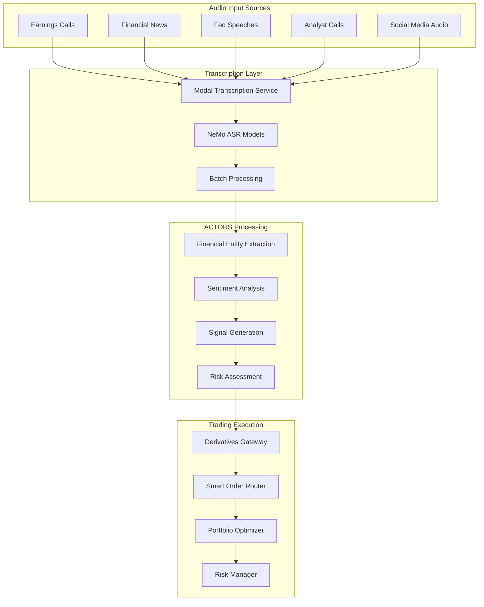

# 🎤➡️📈 Speech-to-Trading Integration Analysis

*Connecting Open-Batch-Transcription with ACTORS Financial Derivatives System*

## 🎯 Executive Summary

The **open-batch-transcription** system presents a powerful opportunity to integrate real-time speech processing with our **ACTORS financial derivatives gateway**. This integration could revolutionize how financial information is processed, analyzed, and acted upon in real-time trading scenarios.

## 🔍 System Analysis

### **Open-Batch-Transcription Capabilities**

#### **Core Technology Stack:**
- **Modal Cloud Platform**: Serverless GPU compute for scalable transcription
- **NeMo ASR Models**: NVIDIA's state-of-the-art speech recognition
  - `nvidia/parakeet-tdt-0.6b-v2`: Hyperfast English transcription
  - `nvidia/canary-1b-flash`: Multilingual transcription
- **Batch Processing**: 100x faster and 100x cheaper than traditional methods
- **Real-time Metrics**: WER (Word Error Rate), RTFX (Real-time Factor)

#### **Performance Characteristics:**
- **Speed**: Sub-second transcription for financial audio streams
- **Accuracy**: High-precision speech-to-text conversion
- **Scalability**: Parallel processing across multiple GPU instances
- **Cost Efficiency**: Modal's serverless pricing model

### **ACTORS Financial System Integration Points**

#### **1. Real-Time Market Audio Processing**
```python
# Potential integration architecture
class FinancialAudioProcessor:
    def __init__(self):
        self.transcription_service = NeMoAsrBatchTranscription()
        self.sentiment_analyzer = SentimentAnalysisAgent()
        self.trading_engine = DerivativesGateway()
    
    async def process_financial_audio(self, audio_stream):
        # Transcribe audio in real-time
        transcription = await self.transcription_service.transcribe(audio_stream)
        
        # Extract financial entities and sentiment
        financial_data = self.extract_financial_entities(transcription)
        sentiment = self.sentiment_analyzer.analyze(transcription)
        
        # Generate trading signals
        if self.is_trading_signal(financial_data, sentiment):
            self.trading_engine.execute_trade(financial_data)
```

#### **2. Earnings Call Analysis**
- **Real-time Earnings Transcription**: Process earnings calls as they happen
- **Sentiment Analysis**: Extract market sentiment from executive commentary
- **Trading Signal Generation**: Automatically generate buy/sell signals
- **Risk Assessment**: Analyze forward-looking statements for risk implications

#### **3. News and Media Monitoring**
- **Financial News Processing**: Transcribe CNBC, Bloomberg, financial podcasts
- **Social Media Audio**: Process financial YouTube channels, Twitter Spaces
- **Regulatory Announcements**: Real-time processing of Fed speeches, SEC announcements
- **Market Commentary**: Analyze analyst calls and market predictions

## 🏗️ Integration Architecture

### **Speech-to-Trading Pipeline**



### **Technical Integration Points**

#### **1. Modal Integration with ACTORS**
```python
# Enhanced Modal integration for financial use cases
class FinancialTranscriptionService:
    def __init__(self):
        self.app = modal.App("financial-speech-processing")
        self.transcription_model = NeMoAsrBatchTranscription()
        self.financial_analyzer = FinancialEntityExtractor()
        
    @self.app.function(
        image=financial_transcription_image,
        gpu="L40S",
        timeout=300
    )
    async def process_financial_audio(self, audio_data, context):
        # Transcribe audio
        transcription = await self.transcription_model.transcribe(audio_data)
        
        # Extract financial entities
        entities = self.financial_analyzer.extract_entities(transcription)
        
        # Generate trading context
        trading_context = {
            'transcription': transcription,
            'entities': entities,
            'timestamp': time.now(),
            'source': context['source'],
            'confidence': transcription['confidence']
        }
        
        return trading_context
```

#### **2. Real-Time Streaming Integration**
```python
# WebSocket integration for real-time processing
class RealTimeFinancialAudioProcessor:
    def __init__(self):
        self.websocket_server = WebSocketServer()
        self.transcription_queue = asyncio.Queue()
        self.trading_signals = TradingSignalGenerator()
        
    async def handle_audio_stream(self, websocket, path):
        async for audio_chunk in websocket:
            # Queue audio for transcription
            await self.transcription_queue.put(audio_chunk)
            
            # Process in background
            asyncio.create_task(self.process_audio_chunk(audio_chunk))
    
    async def process_audio_chunk(self, audio_chunk):
        # Transcribe using Modal
        transcription = await self.transcription_service.transcribe(audio_chunk)
        
        # Generate trading signals
        signals = await self.trading_signals.analyze(transcription)
        
        # Execute trades if signals are strong enough
        if signals['confidence'] > 0.8:
            await self.execute_trades(signals)
```

## 🎯 Use Cases and Applications

### **1. Earnings Call Trading**
- **Real-time Processing**: Transcribe earnings calls as they happen
- **Sentiment Analysis**: Extract positive/negative sentiment from management commentary
- **Forward Guidance Analysis**: Identify changes in forward-looking statements
- **Automated Trading**: Execute trades based on earnings call insights

### **2. Fed Policy Analysis**
- **FOMC Meeting Transcription**: Real-time processing of Fed speeches
- **Policy Signal Detection**: Identify hints about future policy changes
- **Market Impact Prediction**: Predict market reactions to policy statements
- **Interest Rate Trading**: Execute trades based on policy signals

### **3. News-Driven Trading**
- **Breaking News Processing**: Transcribe financial news in real-time
- **Event Detection**: Identify market-moving events from audio content
- **Sentiment-Based Trading**: Trade based on news sentiment
- **Risk Management**: Adjust positions based on news analysis

### **4. Social Media Audio Analysis**
- **Podcast Analysis**: Process financial podcasts for trading insights
- **YouTube Content**: Analyze financial YouTube channels
- **Twitter Spaces**: Process financial discussions on social media
- **Influencer Tracking**: Monitor financial influencers' audio content

## 🔧 Implementation Strategy

### **Phase 1: Foundation (Weeks 1-4)**
1. **Modal Integration**: Set up Modal services for financial transcription
2. **Audio Pipeline**: Create audio ingestion and preprocessing pipeline
3. **Basic Transcription**: Implement basic speech-to-text for financial content
4. **Entity Extraction**: Develop financial entity recognition system

### **Phase 2: Analysis (Weeks 5-8)**
1. **Sentiment Analysis**: Integrate sentiment analysis with transcription
2. **Signal Generation**: Develop trading signal generation from audio
3. **Risk Assessment**: Add risk analysis to audio-derived signals
4. **Backtesting**: Test audio-based trading strategies

### **Phase 3: Trading Integration (Weeks 9-12)**
1. **Derivatives Gateway Integration**: Connect to existing trading infrastructure
2. **Real-time Execution**: Implement real-time trade execution
3. **Portfolio Integration**: Integrate with portfolio optimization
4. **Risk Management**: Add comprehensive risk controls

### **Phase 4: Production (Weeks 13-16)**
1. **Performance Optimization**: Optimize for low-latency processing
2. **Monitoring**: Add comprehensive monitoring and alerting
3. **Compliance**: Ensure regulatory compliance
4. **Scaling**: Scale to handle multiple audio streams

## 📊 Expected Benefits

### **Performance Improvements**
- **Speed**: Sub-second audio processing and signal generation
- **Accuracy**: High-precision financial entity extraction
- **Scalability**: Handle multiple audio streams simultaneously
- **Cost Efficiency**: Leverage Modal's serverless pricing

### **Trading Advantages**
- **Information Edge**: Process audio content faster than competitors
- **Sentiment Analysis**: Real-time sentiment-based trading
- **Event Detection**: Identify market-moving events from audio
- **Risk Management**: Better risk assessment from audio analysis

### **Operational Benefits**
- **Automation**: Reduce manual analysis of audio content
- **Coverage**: Monitor more audio sources than humanly possible
- **Consistency**: Consistent analysis across all audio sources
- **Scalability**: Scale audio processing as needed

## 🚨 Risk Considerations

### **Technical Risks**
- **Latency**: Ensure low-latency processing for time-sensitive trades
- **Accuracy**: Maintain high transcription accuracy for financial content
- **Reliability**: Ensure system reliability for critical trading decisions
- **Scalability**: Handle peak loads during market events

### **Financial Risks**
- **False Signals**: Prevent false trading signals from transcription errors
- **Market Impact**: Consider market impact of automated trading
- **Regulatory Compliance**: Ensure compliance with trading regulations
- **Risk Management**: Implement proper risk controls

### **Operational Risks**
- **Data Quality**: Ensure high-quality audio input
- **System Monitoring**: Monitor system performance and accuracy
- **Backup Systems**: Implement backup systems for critical functions
- **Disaster Recovery**: Plan for system failures and recovery

## 🎯 Next Steps

### **Immediate Actions**
1. **Proof of Concept**: Create a simple proof of concept for audio-to-trading
2. **Modal Setup**: Set up Modal services for financial transcription
3. **Audio Sources**: Identify and test audio sources for financial content
4. **Integration Planning**: Plan integration with existing ACTORS system

### **Short-term Goals (1-3 months)**
1. **Basic Integration**: Implement basic speech-to-trading pipeline
2. **Testing**: Test with real financial audio content
3. **Performance**: Optimize for speed and accuracy
4. **Documentation**: Create comprehensive documentation

### **Long-term Vision (3-12 months)**
1. **Full Integration**: Complete integration with ACTORS system
2. **Production Deployment**: Deploy to production environment
3. **Advanced Features**: Add advanced analysis capabilities
4. **Scaling**: Scale to handle enterprise-level audio processing

## 🌟 Conclusion

The integration of **open-batch-transcription** with the **ACTORS financial derivatives system** represents a significant opportunity to revolutionize financial audio processing and trading. By combining Modal's scalable transcription capabilities with our sophisticated trading infrastructure, we can create a powerful system for real-time audio-driven trading.

This integration will provide:
- **Competitive Advantage**: Process audio content faster than competitors
- **Enhanced Analysis**: Better sentiment and entity analysis from audio
- **Automated Trading**: Real-time trading based on audio insights
- **Scalable Processing**: Handle multiple audio streams simultaneously

The technical foundation is solid, the use cases are compelling, and the potential benefits are significant. With proper implementation and risk management, this integration could become a cornerstone of our financial trading infrastructure.

---

*"The future of financial trading lies not just in processing numbers, but in understanding the human voice behind the markets."* 🎤📈
